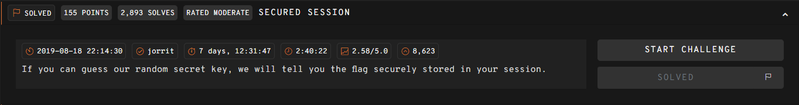
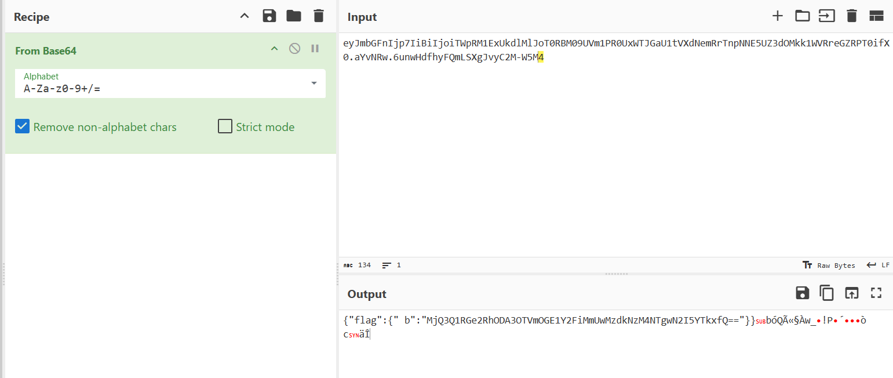

## SECURED SESSION  



The challenge server has a `/flag` endpoint that requires us to supply the correct server secret, and if successful, will return the flag in the session cookie.  

```python
import os
from flask import Flask, request, session
from flag import flag

app = Flask(__name__)
app.config['SECRET_KEY'] = os.urandom(24)

def secret_key_to_int(s):
    try:
        secret_key = int(s)
    except ValueError:
        secret_key = 0
    return secret_key

@app.route("/flag")
def index():
    secret_key = secret_key_to_int(request.args['secret_key']) if 'secret_key' in request.args else None
    session['flag'] = flag
    if secret_key == app.config['SECRET_KEY']:
      return session['flag']
    else:
      return "Incorrect secret key!"

@app.route('/')
def source():
    return "%s" % open(__file__).read()

if __name__ == "__main__":
    app.run()
```

The main vulnerability lies in the order of the operations. The flag is stored in `session['flag']` before the check is executed, and isn't removed at any point in the endpoint.  

JWT tokens only require the secret to be signed as a valid token, but otherwise, the payload body can be Base64-decoded normally.  

After visiting `/flag`, we can retrieve the `session` cookie from the browser and plug it into [CyberChef](https://gchq.github.io/CyberChef/).  

Base64-decoding the cookie will reveal another Base64 string in the payload body, which will decode to the flag.  



Flag: `247CTF{da80795f8a5cab2e037d7385807b9a91}`