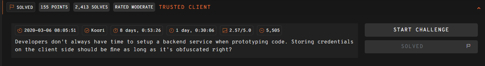
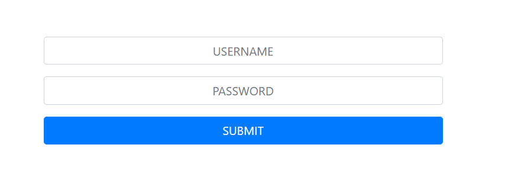
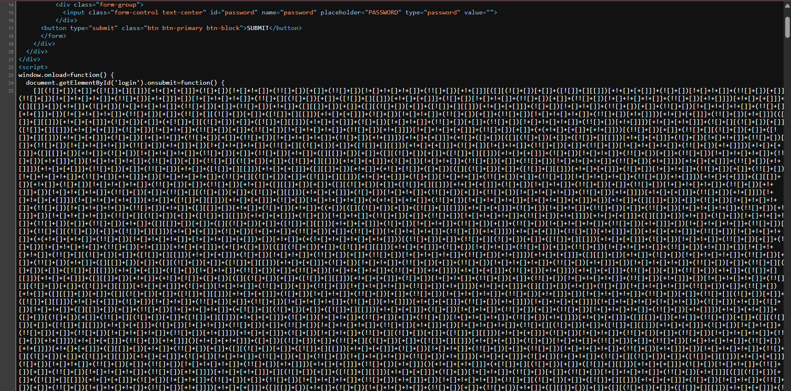

## TRUSTED CLIENT  



We are given a simple login page.  



Inside the HTML source, we can find that the client-side JS has been heavily obfuscated as JSFuck.  



We can use [this decoder](https://www.dcode.fr/jsfuck-language) to deobfuscate it, giving us the original code with the flag hardcoded inside.  

```js
if (this.username.value == 'the_flag_is' && this.password.value == '247CTF{6c91b7f7f12c852f892293d16dba0148}'){ alert('Valid username and password!'); } else { alert('Invalid username and password!'); }
```

Flag: `247CTF{6c91b7f7f12c852f892293d16dba0148}`